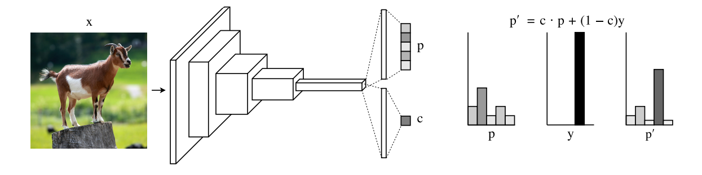
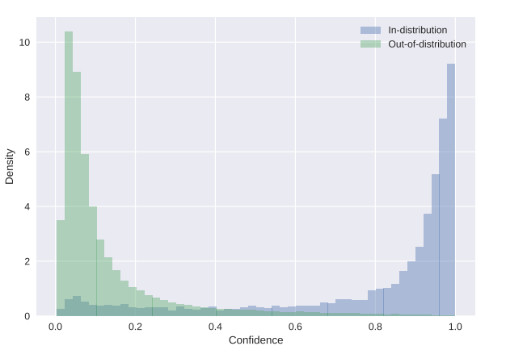
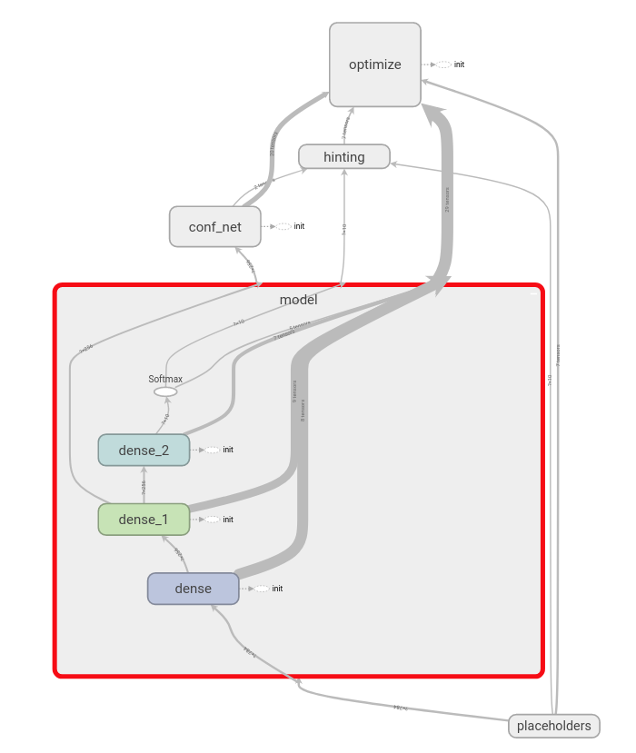
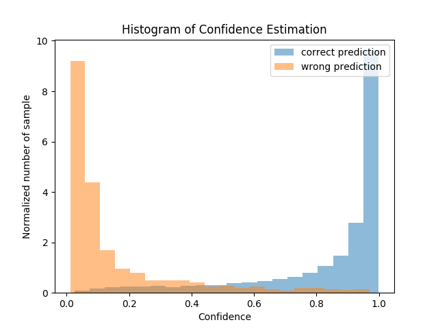
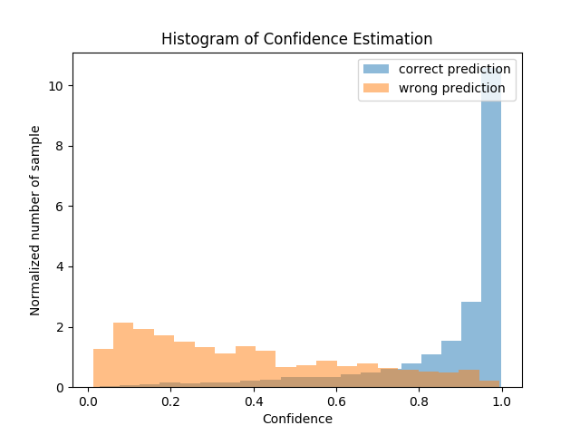

# lookahead_tensorflow
Here is an unofficial implementation and experiement of estimating the confidence for prediction form neural networks from
["Learning Confidence for Out-of-Distribution Detection in Neural Networks"](https://arxiv.org/pdf/1802.04865.pdf) for [Tensorflow](https://www.tensorflow.org/).

</a>

</a>


How to measure the confidence of the network is an interesting topics, and raising more and more attention recently.\
For example, the workshop, [Uncertainty and Robustness in Deep Learning - ICML 2019](https://sites.google.com/view/udlworkshop2019/home).

In this paper, the author propose confidence branch with estimated confidence to perform out-of-distribution detection.\
On the other hand, this confidence can also be use to estimate the uncertainty of the model.

To be brief, the idea of this paper is very intuitive and easy to apply.

- Simple and intuitive!
- very few addictional required.

However, in my opinions, there are still some issues should be discussed and explored.\
The author have proposed some tricks to tackle with these issues. I still work on reproduce them.

- Hyper-parameter is somehow too sensitive, even using the budget proposed in the paper.
- Incompatible with high accuracy model, due to insufficient negative samples.

All in all, if you are finding some works to estimate the uncertainty of the model.\
This work still worth a try because it won't take too much time to test it.


### Environment 
This code is implemmented and tested with [Tensorflow](https://www.tensorflow.org/) 1.13.0. \
I didn't use any spetial operator, so it should also work for other version of tensorflow.

### In a Nutshell
Just run a simple example of classification problem on MNIST dataset.
```
python run_example.py
```

The code run a very simple fully-connected model with a relatively small brach network to estimate confidence.\
You can also turn off the confidence branch by setting `WITH_CONF` to `False` in `run_example.py`.

To check out how this work in Tensorboard:
```
tensorboard --logdir=logs
```

### Usage
1. Set up the parameters of confidence branch.
```
import ood._conf.conf_net import base_conf

conf_admin = base_conf.BaseConfNet(lambda1=1.0)
```

2. During building your own network, branch out in the penultimate layer.
```
confidence = conf_admin.forward(hidden)
```

3. During training, hint you output by the value of confidence.
```
conf_admin.hinting(outputs, labels)
```

4. Add the confidence penalty to your final losses.
```
losses += conf_admin.calculate_loss_conf()
```


### Implementation Details

The outline of the approach is illustrated in the example.
</a>


#### Small and simple branch network
The sub-net is brached out from the penultimate layer as shown in the figure.\
The author use very light-weighted sub-net with small fully-connected layer, leading an ignorable addictional computation.\
However, other structures of networks are also work.

#### The interpolation for hinting
The paper using a simple linear interpolation function to give hints to model.\
In my opinion, different problem should using different interpolation function to generate a smooth interpolated reuslts.

#### The weight of confidence penalty
The weight of the confidence loss (penalty) is very critical and sensitive.
By setting large penalty, the model will avoid to output low confidence predictions.

#### Half batch hinting
As porposed in the paper, only apply hinting on half of the batch.\
Active this feature by setting `half_batch` to `True`, and use specific batch size (not `None`).

#### Budget for auto-tunning
The author propose budget between `[0.1, 1]` for auto tunning the weight of confidence penalty.\
If confidence loss is greater than budger, decrease the weight; otherwise, increase the weight.

The code of using budget will be updated soon.

#### Experimental results
To be brief, the results of MNIST look similar to the paper.\
</a>

However, building a high accuracy model disintegrates the performance of OOD a little bit.
This is caused by the insufficient negative samples. I'm still working on this issue.\
</a>


More experiemntal results on MNIST dataset will be updated soon.

Although the confidence classification problem can also be abtained from the value of softmax,
I found this approach do work in a more elegent manner witch is quite simple .


BTW, I also conducted experiments on other task, such as [3D hand tracking]((https://arxiv.org/abs/1804.09534)).


### TODO
1. Update the budget for auto-tinning the weight of confidence penalty.
2. Detailed analysis on MNIST.
3. The issue of insufficient begative samples.

please let me know if you have any suggestion, I'll be very grateful.


### Contact & Copy Right
Code work by Jia-Yau Shiau <jiayau.shiau@gmail.com>.
